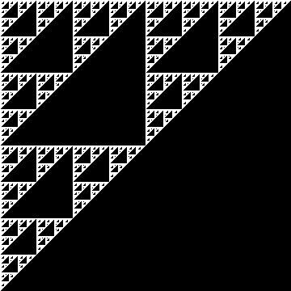
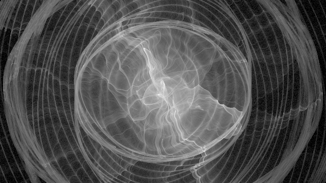
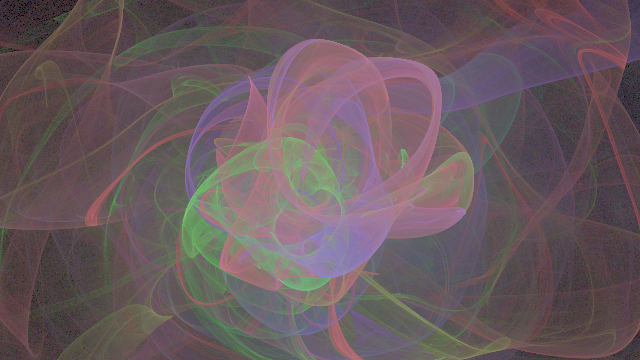

# flame fractal renderer

## what are flame fractals?

Flame fractals are fractals created by certain iterated function systems. They
were created by Scott Draves in 1992. See his paper here:
https://flam3.com/flame_draves.pdf. He also has a software called flam3 which is
the main inspiration for writing this renderer. You can find it here:
https://github.com/scottdraves/flam3.

Flame fractals are based on iterated function systems. They are typically
considered in 2 dimensions for an image, but can be generalized to higher
dimensions. In $n$ dimensions, we have a set of functions $f_i:R^n\to R^n$ with
weights $w_i$ that sum to 1. The details in specifying these functions will come
later. To render a flame fractal, start with a random point $x$ in the biunit
square/cube/hypercube centered at the origin. Then to perform an iteration,
randomly choose a function $f_i$ according to the weights and update $x$ to be
$f_i(x)$. This will generate a sequence of points. For each point (except some
at the beginning to allow the sequence to settle), assign it to an area/volume
in the space $R^n$ divided into tiny squares/cubes/hypercubes.

In 2D, we have functions $f_i:R^2\to R^2$. We divide the 2D plane into small
squares corresponding to pixels. For each pixel, we have a counter that gets
incremented each time the generated sequence lands inside its area. Finally, to
plot the result, the value for each pixel is scaled and then output as a
grayscale image.

Flame fractals can be rendered with color. This is done by assigning colors to
each function and blending them with exponential weighting so that the pixels
are colored according to which functions are most associated with that part of
the image. There is a lot of complexity in methods used to render images with
good appearance.

The functions $f_i$ are defined by a pre-affine and post-affine transformation.
Each of these is a linear transformation that can be defined as $Ax+b$ for some
$n\times n$ matrix $A$ and $n$-vector $b$. Between these, we apply a sum of
variation functions. Then to apply $f_i$ to a point $x$, we first apply the
pre-affine transformation. Next, use this point to compute the variation
function sum. Finally, apply the post-affine transformation to this sum. 

## why another renderer when others exist?

I initially created this because I wanted to create the probability distribution
buffer and then render images based on that with various post-processing and
filtering algorithms. Since the probability distribution buffer is the most
computationally expensive part to generate, it makes sense to save its results
and spend more effort optimizing its computation.

It expanded a bit when I decided to write a whole renderer that I would try to
optimize decently, although that is difficult to do when trying to support
arbitrary functions to be specified in JSON files and when most of the runtime
depends on random access to a large area of memory. I ended up switching from C
to C++ and making the whole thing templated to be able to support different
compile time parameters while maintaining good performance.

Another reason was interest in exploring 3D flame fractals. Higher dimensions
are supported, but no tools have been created for displaying the results in a
meaningful way yet.

## json format

Flames fractals for this software are specified in JSON. See the example flames
for a good idea of how to write them. Comments are allowed in JSON files used
for this program.

The JSON format documentation needs to be improved, especially to show details
about all the variation functions.

## building

Make sure you have the following Ubuntu packages installed (or equivalent on
other distros)

1. `build-essential` (for `make` and `g++`)
2. `wget`
3. `libboost-program-options-dev` (or `libboost-all-dev`)
4. `libpng-dev`

As of the time of writing this, there is a known issue with Boost 1.74 (which
comes from the Ubuntu repositories) where it will not compile with C++20 (which
is required for this project). In order to resolve this, install the latest
version of boost. The following commands are based on this link:
https://www.baeldung.com/linux/boost-install-on-ubuntu

1. `mkdir -p boost/`
2. `cd boost`
3. `wget https://boostorg.jfrog.io/artifactory/main/release/1.84.0/source/boost_1_84_0.tar.bz2`
4. `tar -xvf boost_1_84_0.tar.bz2`
5. `cd boost_1_84_0/`
6. `./bootstrap.sh`
7. `./b2`
8. `sudo ./b2 install --prefix=/usr/local`

Then if everything is setup correctly, running `make all` should build 2
executables, described below.

For development, static linking should be avoided because Valgrind will show
memory errors when glibc is statically linked. The solution I have for now is
to install Boost 1.84 locally so it can be used with dynamic linking.

This was only tested on Ubuntu 20.04 and 22.04 since I only use Ubuntu for
development. Help to expand this section to support other systems would be
appreciated.

## command line options

Currently there are 2 executables: `ffr-buf.out` and `ffr-img.out`. The first
renders a buffer, which can have a number of dimensions specified. The second
is a basic implementation that renders an image from 2D buffers only.

The options for `ffr-buf.out` are:

`-h,--help` help message

`-f,--flame` flame JSON file (required), or `-` for stdin

`-i,--input` specify input buffers (can be used to add more rendering progress
to an existing buffer), used once per input file, `-` for stdin

`-o,--output` output file (required), or `-` for stdout

`-s,--samples` number of samples to render, default is 0 (no rendering)

`-t,--threads` threads for multithreading, default is the number of logical
CPU cores

`-b,--batch_size` number of samples per thread work unit, if 0 or unspecified
then a reasonable size is calculated, larger means less overhead

`-z,--bad_values` number of bad values allowed before render terminates,
default is 16, bad values are indicative of degenerate flame parameters

The options for `ffr-img.out` are:

`-h,--help` help message

`-f,--flame` flame JSON file (required), or `-` for stdin

`-i,--input` input buffers, need at least 1, usue `-` for stdin

`-o,--output` output file, PNG images only for now

`-y,--gamma` gamma parameter for adjusting overall brightness

`-m,--monochrome` binary image (white = nonzero histogram)

`-g,--grayscale` grayscale image from log scaling the histogram

`-c,--color` color image using 3D color vectors for RGB only for now

`-b,--bits` bit depth per channel for gray/color (8 or 16, default 8)

## example commands

Render a flame with 1000000 samples and save the buffer.

`ffr-buf.out -f flame.json -o flame.buf -s 1000000`

Add 1000000 rendering samples to an existing buffer.

`ffr-buf.out -f flame.json -i flame1.buf -o flame2.buf -s 1000000`

Render a grayscale image based on a buffer file using gamma=2.

`ffr-img.out -f flame.json -i flame.buf -o flame.png -g -y 2`

Perform a single threaded render and directly feed the buffer with stdout/stdin
to render a color image with gamma=2.5.

`ffr-buf.out -f flame.json -o - -s 1000000 -t 1 | ffr-img.out -f flame.json -i - -o flame.png -c -y 2.5`
